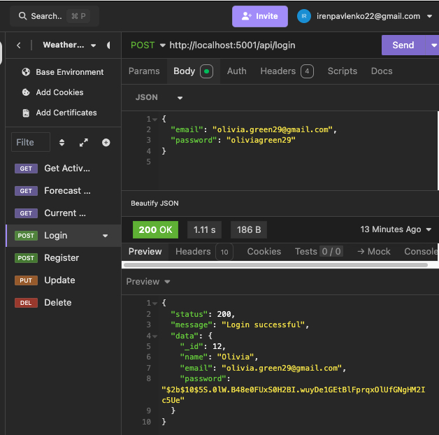
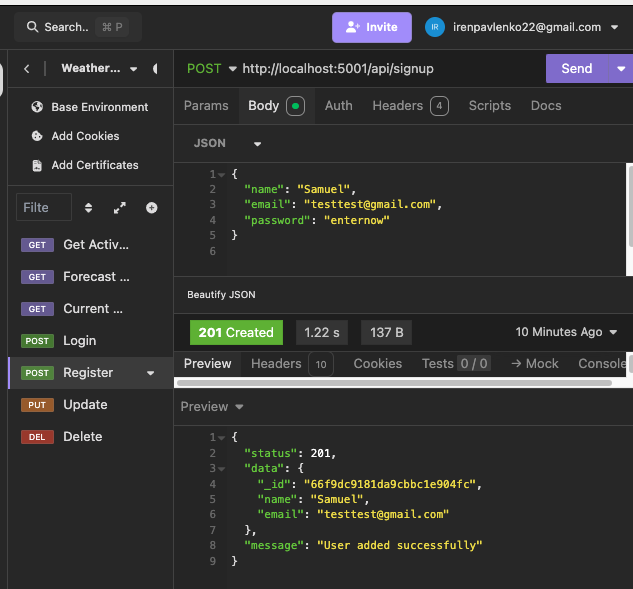
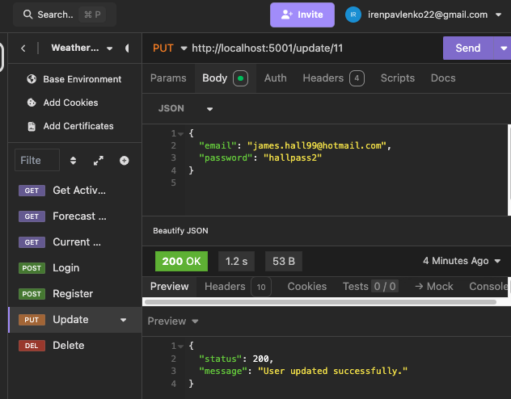
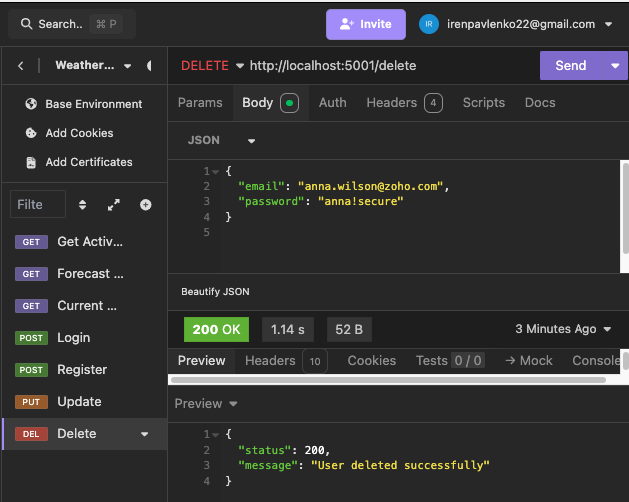
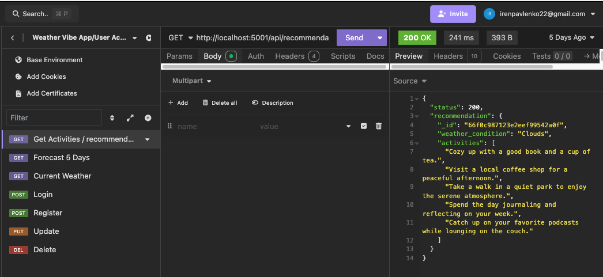
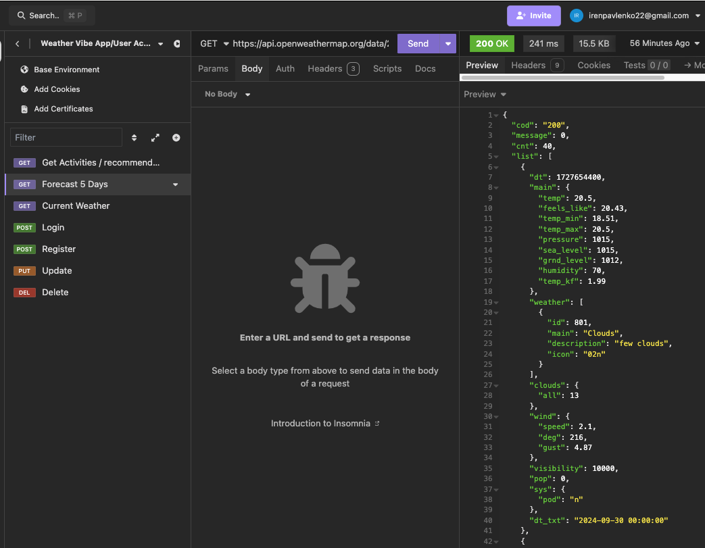

# Meet Your Personal Vibe-Based Weather Buddy!

## About the Project
Welcome to **"Meet Your Personal Vibe-Based Weather Buddy!"** — a unique weather forecasting web application that lets you feel the weather instead of just checking it. Whether it’s cozy sweater weather, sunny beach vibes, or a perfect café day, this app brings the day’s energy to match your lifestyle. It's designed to be simple, fun, and effortlessly cool.

### Features:
- **Weather Recommendations**: Get activity recommendations based on real-time weather conditions.
- **Personalized User Accounts**: Manage your favorites, update your account details.
- **Weather Forecast**: View a detailed 5-day weather forecast tailored to your location.
- **Real-Time Weather Data**: Fetches up-to-date weather information for various cities using the OpenWeatherMap API.
- **User Authentication**: Sign up, login, and log out.

## Project Structure
The project is built using the MERN stack: MongoDB, Express, React, Node.js

## Installation and Setup
### Prerequisites:
- **Node.js (16.x)**
- **MongoDB**

### Setup Instructions:
1. **Clone the repository:**
    ```bash
    git clone <repository-url>
    ```

2. **Install Dependencies:**
   - Navigate to the `client` and `server` directories separately and run:
     ```bash
     npm install
     ```

3. **Environment Variables:**
   - Configure the environment variables in `/client/.env` and `/server/.env` as follows:
   
**Client `.env`**:
```bash
REACT_APP_API_URL=http://localhost:5001
```

**Server `.env`**:
```bash
MONGO_URI=<your-mongodb-connection-uri>
```

4. **Run the Project:**
From the root directory, run the following command to start both the server and client:
```bash
npm run dev
```

The application will start on:

- **Frontend**: [http://localhost:3000](http://localhost:3000)
- **Backend**: [http://localhost:5001](http://localhost:5001)

## Tested API Endpoints

The following API endpoints have been tested using Insomnia:

- **User Sign Up**: `POST /api/signup`
- **User Login**: `POST /api/login`
- **Update User**: `PUT /update/:id`
- **Delete User**: `DELETE /delete`
- **Get Weather Recommendation**: `GET /api/recommendation/:weather_condition`

## Screenshots of Tests

Here are the screenshots demonstrating various Insomnia test results:

- **Login Test**:
  
  

- **Register Test**:
  
  

- **Update User Test**:
  
  

- **Delete User Test**:
  
  

- **Get Activities Test**:
  
  

- **Weather Forecast Test**:
  
  

- **Current Weather Test**:
  
  

## Deployment

The app is deployed on **Vercel** and accessible via:

- **Frontend**: [https://vbwb.vercel.app](https://vbwb.vercel.app)
- **Backend API**: [https://vbwb.vercel.app/api](https://vbwb.vercel.app/api)

## Technology Stack

- **Frontend**: React, React Router, CSS Modules
- **Backend**: Node.js, Express
- **Database**: MongoDB
- **API Integration**: OpenWeatherMap API

## Future Enhancements

- **Improve UI/UX**: Enhance the UI for a more dynamic user experience.
- **Additional Weather Features**: Integrate weather recommendations tailored to specific cities.
- **Social Sharing**: Allow users to share their favorite weather-based activities on social media.

## License

This project is licensed under the **ISC License**. See the [LICENSE](./LICENSE) file for details.

## Project Author

**Irene Pavlenko** 